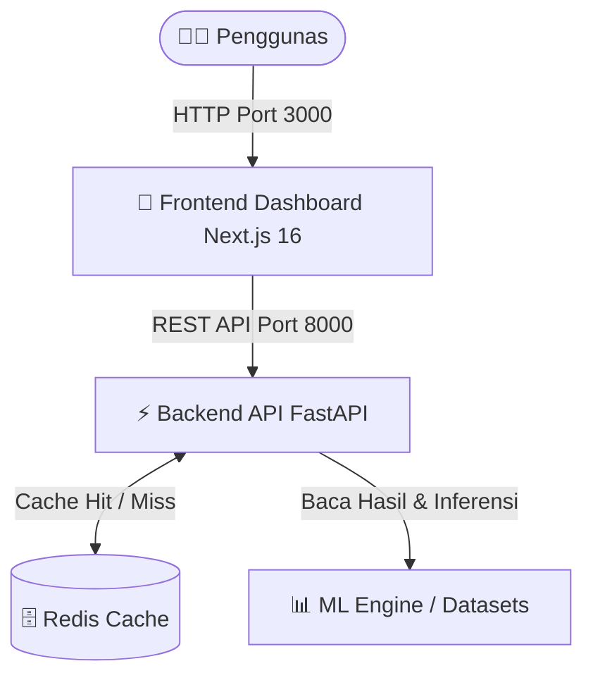

# 📈 Prediksi IHSG dengan Model Hybrid SARIMAX-LSTM & Web Dashboard

Implementasi Model **Hybrid SARIMAX-LSTM** dengan Multiple Exogenous Variables untuk Prediksi **Indeks Harga Saham Gabungan (IHSG)** yang dilengkapi dengan **Full-Stack Web Dashboard (Next.js 16 + FastAPI + Redis Cache + Docker Compose)**.

> **Proposal Skripsi** — Pande Kadek Nathan Prabhaswara Sudiara Putra (NIM: 235150207111051)  
> Teknik Informatika, Fakultas Ilmu Komputer, Universitas Brawijaya

---

## 🌟 Arsitektur Sistem & Dashboard Web

Proyek ini tidak hanya mencakup pemodelan Machine Learning, tetapi juga dikemas dalam ekosistem aplikasi web modern yang siap diproduksi (*Production-Ready*):



### 🎨 Frontend (`stock-prediction-fe/`)
- **Next.js 16 (App Router & Turbopack)**: Dikonfigurasi dalam mode `standalone` untuk efisiensi kontainer Docker.
- **Shadcn UI & Tailwind CSS**: Antarmuka bertema **Black & Orange** bernuansa futuristik dengan tipografi **Poppins**.
- **TradingView-Style Charting**: Grafik interaktif menggunakan **Recharts** dengan interpolasi *Linear* (menampilkan fluktuasi sudut tajam asli pasar tanpa artificial smoothing) serta kontrol rentang waktu (**1M, 3M, 6M, ALL**) dan garis *crosshair* putus-putus berwarna oranye untuk inspeksi presisi tingkat hari (*Day-Level Granularity*).

### ⚡ Backend (`stock-prediction-be/`)
- **FastAPI & Uvicorn**: Menyediakan REST API cepat (`/history`, `/metrics`, `/predict/{ticker}`).
- **Redis Caching**: Menyimpan hasil prediksi harian agar permintaan berulang tidak perlu melatih ulang model secara berkala, meningkatkan waktu respons secara drastis.

### 🤖 Machine Learning (`stock-prediction-ml/`)
- Eksperimen utama dan visualisasi disimpan secara terorganisir pada folder `stock-prediction-ml/`, mencakup dataset bersih, metrik evaluasi, serta plot analisis komprehensif.

---

## 📋 Deskripsi Skenario Model ML

Proyek ini mengimplementasikan dan membandingkan tiga skenario model prediksi harga penutupan harian IHSG:

| No | Model | Deskripsi |
|:---:|---|---|
| 1 | **Hybrid SARIMAX-LSTM Multivariat** | SARIMAX dengan 3 variabel eksogen + LSTM untuk residual non-linear |
| 2 | **Hybrid SARIMAX-LSTM Univariat** | SARIMAX tanpa variabel eksogen + LSTM untuk residual non-linear |
| 3 | **LSTM Tunggal** | LSTM standalone yang langsung memprediksi harga IHSG |

### Variabel Eksogen
| Variabel | Ticker Yahoo Finance | Keterangan |
|---|:---:|---|
| Kurs USD/IDR | `IDR=X` | Nilai tukar Rupiah terhadap Dolar AS |
| Harga Emas Dunia | `GC=F` | Harga emas dunia (XAU/USD) |
| Indeks S&P 500 | `^GSPC` | Indeks saham utama Amerika Serikat |

---

## 🚀 Cara Menjalankan (Opsi Tercepat: Docker Compose)

Cara paling disarankan dan termudah untuk menjalankan seluruh sistem (Frontend, Backend API, dan Redis Cache) secara serentak adalah menggunakan **Docker Compose**.

### Prasyarat
- **Docker Desktop** atau **Docker Engine** terinstall dan aktif.

### Langkah Eksekusi:
```bash
# 1. Clone repositori
git clone https://github.com/Vallykrie/stock-prediction.git
cd stock-prediction

# 2. Jalankan container secara background dengan build otomatis
docker compose up --build -d
```

Sesudah container aktif:
- 🌐 **Web Dashboard Frontend**: Akses [http://localhost:3000](http://localhost:3000)
- ⚡ **Backend API Docs (Swagger UI)**: Akses [http://localhost:8000/docs](http://localhost:8000/docs)

Untuk mematikan sistem:
```bash
docker compose down
```

---

## 🛠️ Cara Menjalankan Secara Manual (Lokal / Pengembangan)

Jika ingin menjalankan secara terpisah tanpa Docker:

### 1. Menjalankan Backend API
```bash
cd stock-prediction-be
pip install -r requirements.txt
# (Opsional) Pastikan Redis server berjalan lokal, atau API akan berjalan dengan in-memory fallback
uvicorn main:app --port 8000 --reload
```

### 2. Menjalankan Frontend Dashboard
```bash
cd stock-prediction-fe
npm install
npm run dev
```

### 3. Menjalankan Eksperimen ML (Jupyter Notebook)
```bash
cd stock-prediction-ml
conda create -n prediction python=3.12 -y
conda activate prediction
pip install numpy pandas matplotlib seaborn yfinance statsmodels scikit-learn tensorflow tqdm ipywidgets jupyter
jupyter notebook stock_prediction.ipynb
```

---

## 📊 Hasil Evaluasi Model

Metrik evaluasi yang digunakan: **RMSE**, **MAE**, dan **MAPE**.

| Model | RMSE | MAE | MAPE (%) |
|---|:---:|:---:|:---:|
| Hybrid SARIMAX-LSTM Multivariat | 94.97 | 64.57 | 0.8753 |
| **Hybrid SARIMAX-LSTM Univariat** | **92.62** | **61.61** | **0.8343** |
| LSTM Tunggal | 339.08 | 292.70 | 3.8004 |

> ✅ **Model Terbaik:** **Hybrid SARIMAX-LSTM Univariat** dengan MAPE **0.83%** (kategori: Sangat Baik / *Highly Accurate*).

### Temuan Utama
1. **Model Hybrid mengalahkan LSTM Tunggal secara signifikan.** Pendekatan rolling one-step-ahead pada SARIMAX yang dikombinasikan dengan LSTM untuk memodelkan residual non-linear terbukti jauh lebih akurat dibandingkan LSTM standalone.
2. **Model Univariat sedikit lebih unggul dari Multivariat.** Hal ini mengindikasikan bahwa harga penutupan IHSG harian sudah merangkum informasi makroekonomi (*Efficient Market Hypothesis*), sehingga penambahan variabel eksogen mengintroduksi sedikit *noise* tambahan.
3. **Semua model Hybrid memiliki MAPE < 1%**, menunjukkan kemampuan peramalan yang sangat presisi untuk prediksi jangka pendek (*one-step-ahead*).

---

## 📁 Struktur Proyek

```
stock-prediction/
│
├── docker-compose.yml           # Orkestrasi Full-Stack (Frontend + Backend + Redis)
├── README.md                    # Dokumentasi proyek (file ini)
├── proposal.md                  # Proposal skripsi (format teks)
├── Proposal Skripsi_...pdf      # Proposal skripsi (format PDF)
│
├── stock-prediction-fe/         # Frontend Web Dashboard (Next.js 16)
│   ├── app/                     # App Router, Layout Poppins, Black/Orange Theme
│   ├── components/              # TradingView Chart, Metrics Showcase, Sandbox UI
│   └── Dockerfile               # Multi-stage standalone build Dockerfile
│
├── stock-prediction-be/         # Backend API Server (FastAPI)
│   ├── main.py                  # Endpoint REST API (/history, /metrics, /predict)
│   ├── cache.py                 # Manajemen Redis Cache koneksi & fallback
│   ├── model.py                 # ML inference engine bridge
│   └── Dockerfile               # Backend Dockerfile
│
└── stock-prediction-ml/         # Machine Learning Research Workspace
    ├── stock_prediction.ipynb   # Notebook penelitian & eksperimen utama
    ├── results/                 # Output CSV (evaluation_metrics.csv, predictions_results.csv)
    └── plots/                   # Output visualisasi grafik (ACF/PACF, Loss history, dll.)
```

---

## ⚙️ Parameter Model ML

| Parameter | Nilai |
|---|---|
| Periode Data | Januari 2010 – Januari 2026 |
| Rasio Train/Test | 80% / 20% |
| SARIMAX Order | Ditentukan melalui Grid Search (AIC) |
| SARIMAX Prediction | Rolling one-step-ahead (`append`, `refit=False`) |
| LSTM Look-back | 30 time steps |
| LSTM Units | 50 |
| LSTM Dropout | 0.2 |
| Learning Rate | 0.001 |
| Optimizer | Adam |
| Epochs | 100 (Early Stopping, patience=10) |
| Batch Size | 32 |
| Scaler | MinMaxScaler [0, 1] |

---

## 📚 Referensi

1. **Achmadi dkk. (2023)** — Hybrid SARIMAX-LSTM untuk prediksi harga cryptocurrency
2. **Yusuf (2021)** — Penerapan LSTM untuk prediksi IHSG
3. **Hochreiter & Schmidhuber (1997)** — Long Short-Term Memory

---

## 📄 Lisensi

Proyek ini dikembangkan sebagai bagian dari tugas akhir (skripsi) di Program Studi Teknik Informatika, Fakultas Ilmu Komputer, Universitas Brawijaya.
